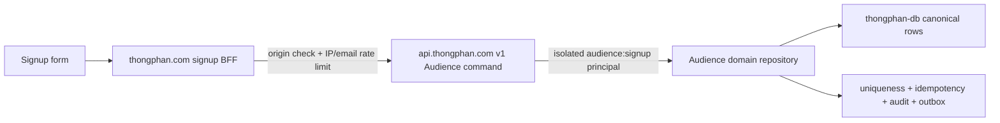

# Audience signup -> Data Platform cutover

- Updated: 2026-08-23
- Current verdict: `LOCAL_PASS_LIVE_NOT_CUT_OVER`
- Public surface: `POST https://thongphan.com/api/signup`
- Canonical domain owner: Audience
- Canonical production store: existing D1 `thongphan-db`
- Logical ingress: `POST https://api.thongphan.com/v1/audience/challenge-signups`

## Scope

This is one strangler slice, not a website rewrite. It moves only the Brain2
challenge registration command behind the shared gateway. It does not move Git
content, Brain2 Markdown/YAML, Read packages, browser bookmarks, protected Brain2
access, the inert email campaign, Learn or any other website route.

## Ownership and request path

The browser receives the existing `{success,message,signup_id}` DTO and never
receives a database credential, table name or unrestricted mutation shape. The
website BFF keeps abuse protection. The gateway owns schema validation,
normalization, identity from the authenticated consumer, idempotency, uniqueness,
audit and the atomic canonical commit.

## Verified current production inventory

Read-only Wrangler queries were pinned by the existing signup config to D1 UUID
`7cffb7f5-c48b-49c2-b215-9611abd734a5` and wrote zero rows.

| Object | Current count |
| --- | ---: |
| `challenges` | 1 |
| `challenge_signups` | 12 |
| normalized challenge/email identities | 11 |
| normalized duplicate groups | 1 |
| extra duplicate source rows | 1 |
| `email_queue` | 210 |
| `email_logs` | 0 |
| `brain2_access_failures` | 33 |

All 12 stored names are nonblank and all 12 emails pass the existing basic email
shape check. The latest signup is `2026-08-11T23:53:31.922Z`. No name or email was
printed into task evidence.

## Migration behavior

The Data Platform domain migration creates:

- `audience_signup_keys`: one normalized challenge/email claim pointing to the
  canonical legacy or newly created signup;
- `audience_idempotency_receipts`: exact consumer/key/request-hash result;
- `audience_audit_log`: actor, consumer, action, subject and request lineage;
- `audience_outbox_events`: PII-minimized domain change record;
- `audience_data_quality_quarantine`: explicit review state for source conflicts.

It does not delete or overwrite `challenge_signups`. For a legacy normalized
duplicate, the earliest stable row becomes the uniqueness owner and every extra
source row remains in place with a quarantine reason. A production-like local
SQLite fixture retained both source rows, created one key, quarantined one extra
row, returned `integrity_check=ok` and had zero foreign-key findings.

## Local implementation evidence

- The BFF gateway mode performs no D1 statement and forwards only the approved
  command DTO with bearer, request and idempotency headers.
- Missing gateway credential fails closed; the legacy direct-D1 branch remains
  only as a version rollback path until live acceptance and a separately reviewed
  binding retirement.
- The browser keeps one random idempotency key across a retry and rotates it when
  form input changes.
- Data Platform Node contract, Workers+D1 integration and TypeScript gates pass.
- Website signup tests and both website TypeScript gates pass.

## One reviewed live sequence

No item below has been executed by this implementation task.

1. Snapshot both Worker traffic baselines and the production consumer directory.
2. Bind `AUDIENCE_DB` in staging to the existing staging Data Platform D1 to avoid
   a new Cloudflare resource. Apply the Audience migration there and seed only a
   synthetic `example.invalid` challenge identity.
3. Append one isolated `audience:signup` consumer to staging. Deploy the immutable
   gateway version and prove first write, exact replay, fresh-key duplicate,
   wrong-scope `403`, table counts and unchanged registry baseline.
4. Export production `thongphan-db` to a mode-0600 backup, record SHA-256 and D1
   Time Travel bookmark, restore locally, and verify integrity, foreign keys and
   exact counts.
5. Apply the production Audience migration. Read back 12 source signups, 11 keys,
   exactly 1 quarantine row and zero change to the 210 legacy email rows.
6. Bind production Data Platform `AUDIENCE_DB` to the existing `thongphan-db`,
   append one isolated consumer without changing existing entries, upload and
   promote the immutable version, then verify all bindings and old Reach/Learn
   probes.
7. Store the same consumer token only as `DATA_PLATFORM_AUDIENCE_TOKEN` on the
   signup BFF. Upload/promote the BFF with `DATA_PLATFORM_URL` set to the exact
   gateway hostname.
8. Perform one bounded synthetic public signup, replay it with the same key, test
   a fresh-key duplicate, compare exact database deltas and retain the synthetic
   row as labelled operational evidence unless a separate exact deletion is
   approved.
9. On failure, restore both Worker traffic baselines. The migration is additive,
   so the old Worker remains readable; do not delete new control tables during
   an incident.
10. After a stable acceptance window, remove direct signup D1 authority in a
    separate task. Keep D1 on Pages only while `/api/challenges` still needs it.

## Stop conditions

Stop before mutation if the backup cannot be restored, the D1 bookmark or binding
identity is uncertain, consumer preservation is not exact, staging modifies
registry rows, production counts differ from this inventory, any email becomes
sendable, or Cloudflare asks for a paid upgrade.
