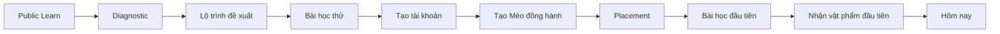
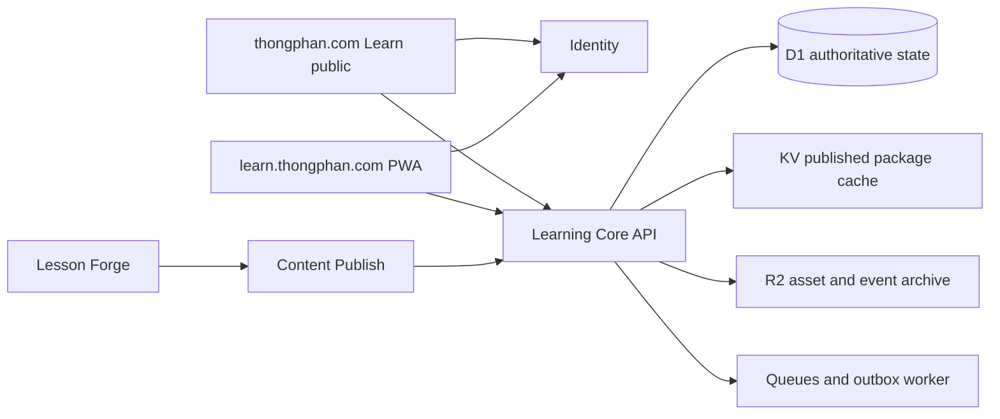

# Đặc Tả Hệ Thống Learn Cat World Của thongphan.com

**Trạng thái:** Đã được anh Thông duyệt hướng hệ lai và Cat World ngày 11/07/2026

**Ngày:** 11/07/2026

**Bề mặt công khai:** `https://thongphan.com/learn`

**Ứng dụng người học:** `https://learn.thongphan.com`

**Repo người học hiện tại:** `/Users/rio/Projects/learn-conan-school`

**Công cụ biên soạn:** `/Users/rio/plugins/learn-lesson-forge`

## 1. Quyết Định Sản Phẩm

Learn trở thành hệ thống học AI tương tác nằm trong hệ sinh thái Thông Phan, vận hành theo kiến trúc hệ lai:

- `thongphan.com/learn` phụ trách khám phá, chẩn đoán, giới thiệu khóa học, thanh toán và cầu nối sang Conan Maker;
- `learn.thongphan.com` phụ trách học tập tập trung, luyện tập, tiến độ, Cat World, phần thưởng, tủ đồ, tác phẩm và bảng xếp hạng;
- hai bề mặt dùng chung danh tính, Quyền học và Learning Core API;
- Lesson Forge nằm ngoài ứng dụng người học, chỉ xuất bản lesson package bất biến sau validation và phê duyệt;
- Conan Maker giữ vai trò sản phẩm có cộng đồng, phản hồi người thật và môi trường triển khai dài hạn.

Lõi sản phẩm là học để thuần thục. Cat World là lớp nhận diện, động lực và niềm vui. Vật phẩm, Cấp mèo, Dấu Chân hoặc thứ hạng không bao giờ được thay thế, mua hoặc làm tăng Độ thuần thục.

## 2. Lời Hứa Sản Phẩm

> Mỗi ngày 15 phút, người đi làm biến AI từ một công cụ thử nghiệm thành năng lực nghề nghiệp có thể áp dụng và chứng minh.

### Người học chính

- người Việt 25-35 tuổi đang đi làm;
- creator, marketer, founder, manager và knowledge worker;
- người bận rộn cần phiên học 12-18 phút;
- người mới đang rối vì AI và người đã dùng rời rạc nhưng thiếu hệ thống;
- người thích học bằng thao tác, tình huống và phản hồi hơn là xem video dài.

### Công việc người học thuê sản phẩm làm

1. Xác định đúng điểm bắt đầu thay vì tự đoán.
2. Học năng lực AI có thể chuyển giao, không chỉ nhớ giao diện một công cụ tạm thời.
3. Biến mỗi khái niệm thành một hành động hoặc đầu ra dùng được trong công việc.
4. Có lý do quay lại mỗi ngày mà không bị dọa mất streak, mất mạng hoặc làm mèo buồn.
5. Đi từ học miễn phí sang khóa trả phí và Conan Maker bằng một thang giá trị rõ ràng.

## 3. Nguyên Tắc Trải Nghiệm

1. **Tương tác trước giải thích:** người học dự đoán, chọn, kéo, xây hoặc so sánh trước khi đọc lời giải đầy đủ.
2. **Một màn hình, một quyết định:** mỗi màn học vừa trọn viewport và chỉ có một hành động chính.
3. **Hoạt động không phải năng lực:** hoàn thành, Dấu Chân và thứ hạng không chứng minh người học đã giỏi.
4. **Chuyển giao sang công việc:** mỗi khóa kết thúc bằng một Tác phẩm hoặc quyết định có thể sử dụng thật.
5. **Game ở ngoài, tập trung ở trong:** Cat World phong phú ở shell, bản đồ, phần thưởng và hồ sơ; màn học luôn yên tĩnh.
6. **Không có nền kinh tế trừng phạt:** không hearts, đói, bệnh, mất đồ, mất quyền học hoặc trả tiền để hồi sinh.
7. **Không pay-to-win:** tiền chỉ mở nội dung; không mua mastery, Dấu Chân, thứ hạng hoặc lợi thế chấm điểm.
8. **Vui theo gu người lớn:** biểu cảm, sưu tầm và có cá tính nhưng không biến thành game trẻ em.
9. **Chỉ hiện nội dung đã xuất bản:** người học không thấy prompt sinh bài, authoring hay admin.
10. **Bằng chứng thật:** hiệu ứng thưởng tạo hứng thú, còn claim học tập phải dựa trên mastery và Tác phẩm.

## 4. Ranh Giới Sản Phẩm

| Bề mặt | Sở hữu | Không sở hữu |
|---|---|---|
| `thongphan.com` | niềm tin, nội dung công khai, diagnostic, catalog Learn, checkout, cầu nối Conan | lesson session, tủ đồ, leaderboard, mastery |
| `learn.thongphan.com` | onboarding, học, luyện tập, Cat World, phần thưởng, tác phẩm, xếp hạng | biên soạn nội dung, thư viện editorial, sales page dài |
| Learning Core API | Quyền học, ghi danh, tiến độ, mastery, reward, inventory, leaderboard | bố cục public site, authoring UI |
| Lesson Forge | nhận brief, sinh nháp, validate, fixture, yêu cầu publish | danh tính người học, payment, progress, reward |
| Conan Maker | cộng đồng, human feedback, accountability, triển khai nâng cao | phân phối khóa tự học nền tảng |

`/library` tiếp tục là thư viện đọc. Nó không trở thành catalog khóa học. Catalog công khai nằm ở `/learn`; catalog bên trong ứng dụng người học mang tên `Học viện`.

## 5. Kiến Trúc Thông Tin Hệ Lai

### Route công khai trên `thongphan.com`

| Route | Vai trò | Hành động chính |
|---|---|---|
| `/learn` | tổng quan Learn và gợi ý điểm bắt đầu | Làm chẩn đoán hoặc Học miễn phí |
| `/learn/free` | giới thiệu đầy đủ AI Foundation miễn phí | Bắt đầu miễn phí |
| `/learn/paths/[slug]` | giải thích một Lộ trình | Xem khóa đầu tiên |
| `/learn/courses/[slug]` | outcome, syllabus, preview, bằng chứng, Quyền học | Học thử hoặc Mở khóa |
| `/learn/checkout/[offer]` | xác nhận tài khoản và thanh toán | Thanh toán |
| `/learn/receipt` | xác nhận Quyền học và handoff | Vào học ngay |
| `/diagnostic` | xác định điểm bắt đầu và độ tin cậy | Xem Lộ trình đề xuất |

Universal navigation của website thêm mục `Học` nhưng giữ nguyên `Thư viện`. Để desktop và mobile vẫn có đúng năm primary destination, `Tài sản` chuyển xuống secondary menu/footer:

1. `Câu chuyện`
2. `Thư viện`
3. `Học`
4. `Chẩn đoán`
5. `Conan Maker`

Public Learn dùng hệ Unified Cinema với route mode riêng là `learning-dossier`. `/assets` và `/challenges` vẫn truy cập được nhưng không cạnh tranh với Learn ở primary navigation.

### Route người học trên `learn.thongphan.com`

| Route | Màn hình |
|---|---|
| `/` | Hôm nay |
| `/onboarding` | mục tiêu, lịch học, tạo Mèo đồng hành |
| `/placement` | 6-12 placement challenge |
| `/path` | Bản đồ Lộ trình hiện tại |
| `/courses` | Học viện |
| `/courses/[courseId]` | bản đồ khóa và trạng thái mở khóa |
| `/lesson/[sessionId]` | Lesson Player toàn màn hình |
| `/practice` | review đến hạn và fix-it set |
| `/artifacts` | thư viện Tác phẩm riêng tư |
| `/artifacts/[artifactId]` | phiên bản Tác phẩm và rubric |
| `/leaderboard` | Giải đấu tuần có thể tắt |
| `/cat` | Mèo đồng hành, Đặc tính mèo và bộ sưu tập |
| `/wardrobe` | thay avatar và quản lý Tủ đồ |
| `/profile` | tóm tắt học tập, achievement và setting |

Bottom navigation có đúng năm điểm đến:

1. `Hôm nay`
2. `Bản đồ`
3. `Học viện`
4. `Xếp hạng`
5. `Mèo của tôi`

`Tủ đồ`, `Luyện tập` và `Tác phẩm` được mở theo ngữ cảnh từ Hôm nay hoặc Mèo của tôi. Setting tài khoản nằm bên trong Mèo của tôi. Không thêm tab cấp cao thứ sáu.

## 6. Luồng Lần Đầu



### Điều kiện pass của phiên đầu

- Người học được chạm vào một tương tác trước khi bị yêu cầu tạo tài khoản.
- Chỉ yêu cầu tài khoản khi cần lưu tiến độ.
- Tạo mèo có ít lựa chọn được tuyển trước và hoàn thành trong tối đa 45 giây.
- Người mới hoàn toàn được phép bỏ qua placement.
- Phần thưởng đầu tiên là cố định: một charm vòng cổ sau bài học có ý nghĩa đầu tiên.
- Chỉ xin quyền notification sau khi người học hoàn thành một bài và chọn lịch học.

## 7. Mô Hình Nội Dung

```text
Domain -> Path -> Course -> Level -> Lesson -> Step -> Interaction
```

| Thuật ngữ nội bộ | Tên hiển thị | Định nghĩa |
|---|---|---|
| Path | Lộ trình | chuỗi khóa học có thứ tự để phát triển một nhóm năng lực |
| Course | Khóa học | kết quả kỹ năng hoàn chỉnh trong 2-6 tuần |
| Level | Chặng | bốn bài, một review và một thử thách ứng dụng |
| Lesson | Bài học | phiên học tương tác gồm 12-15 màn hình |
| Review | Luyện tập | truy hồi hoặc remediation dựa trên evidence |
| Challenge | Thử thách cuối chặng | kiểm tra ứng dụng với scaffold thấp |
| Artifact | Tác phẩm | đầu ra dùng lại được với rubric evidence |
| Coach | Mèo Dẫn Đường | gợi ý và phản tư có cấu trúc |

Nội dung đã publish là bất biến. Tiến độ luôn tham chiếu `lesson_version_id`; publish mới tạo version mới và không sửa evidence của version cũ.

## 8. Kiến Trúc Chương Trình Học

### Lộ trình 1 - AI nền tảng cho công việc

1. `AI Foundation` - miễn phí toàn bộ.
2. `Prompt Thinking` - trả phí.
3. `Evaluate & Verify` - trả phí.

### Lộ trình 2 - AI tăng hiệu suất

1. `Research & Synthesis`.
2. `Writing & Communication`.
3. `Meetings, Decisions & Data`.

### Lộ trình 3 - AI Workflow nâng cao

1. `Brain2 - Hệ thống tri thức cá nhân`.
2. `Workflow Automation`.
3. `AI Agents & Evaluation`.

Lộ trình theo nghề cho marketer, creator, founder và manager chỉ mở sau khi foundation chứng minh được completion và retention. Chúng tái sử dụng skill nền tảng đã mastered, không dạy lại phần nhập môn.

### Quy mô một khóa

- 4-6 Chặng;
- 4 Bài học trong mỗi Chặng;
- 1 checkpoint Luyện tập trong mỗi Chặng;
- 1 Thử thách cuối chặng;
- 1 Tác phẩm cuối khóa;
- hoàn thành trong 2-6 tuần với nhịp khoảng 15 phút/ngày.

## 9. Contract Bài Học 12-15 Màn Hình

Một Bài học có **12-15 màn hình học**. Màn chúc mừng hoàn thành nằm sau lesson và không được tính vào 12-15 màn hình này.

Mặc định một lesson có 14 màn:

| Màn | Vai trò học tập | Tương tác điển hình |
|---:|---|---|
| 1 | tình huống công việc mở đầu | chọn hành động đầu tiên |
| 2 | dự đoán | đoán output hoặc lỗi của AI |
| 3 | thử lần đầu | select, order hoặc compose nhanh |
| 4 | phản hồi và reframe | đối chiếu giả định với bằng chứng |
| 5 | hé lộ khái niệm | thao tác mô hình trực quan |
| 6 | phân rã có hướng dẫn | sort hoặc match các thành phần |
| 7 | xây với scaffold | drag-build hoặc fill-compose |
| 8 | so sánh hai output | highlight bằng chứng mạnh hơn |
| 9 | chẩn đoán lỗi | tìm thiếu sót hoặc context sai |
| 10 | thử lại với ít trợ giúp | biến thể của vấn đề trước |
| 11 | chuyển sang tình huống nghề khác | áp dụng cùng skill vào bối cảnh mới |
| 12 | kiểm tra độc lập A | không hiện hint chủ động |
| 13 | kiểm tra độc lập B | cùng skill, hình thức mới |
| 14 | hạt giống Tác phẩm | lưu nháp hoặc quyết định hành động |

Lesson được phép có 12 màn khi skill hẹp và 15 màn khi cần thêm misconception hoặc transfer check. Content team không được chèn summary thụ động để đủ số lượng.

### Luật mỗi màn hình

- một hành động chính;
- không cuộn dọc ở width 320, 360, 390 và 412px;
- không bottom navigation;
- không upsell khóa học;
- không preview Tủ đồ, item drop hoặc leaderboard;
- không reward animation trước khi evidence bắt buộc được ghi nhận;
- body copy thông thường dưới 80 từ tiếng Việt;
- touch target tối thiểu 48px;
- drag và match luôn có phương án keyboard/non-drag;
- input không mất sau answer sai, reconnect hoặc mở lại app;
- answer sai nhận phản hồi dạy học, không bị trừ điểm hoặc mạng.

### Tương tác P0

1. Select.
2. Sort.
3. Match.
4. Fill hoặc compose.
5. Drag-build.
6. Compare.
7. Diagnose.
8. Highlight evidence.

### Tương tác P1

1. Branching scenario.
2. Prompt hoặc workflow simulator.
3. Role-play.
4. Artifact rubric review.

Mọi interaction package giữ `schema_version`, `config`, `evaluator`, `state_schema`, `feedback_map`, `events`, `a11y` và fixtures.

## 10. Thang Phản Hồi

1. **Sai lần đầu:** chỉ ra điểm phân biệt liên quan, chưa lộ đáp án.
2. **Sai lần hai:** thêm một clue mạnh hơn hoặc giảm choice space.
3. **Sai lần ba:** giải thích reasoning, giữ input và yêu cầu thử lại.
4. **Sau khi đúng:** giải thích vì sao đúng và đối chiếu với phương án sai dễ nhầm nhất.
5. **Independent check:** không chủ động hiện hint; dùng trợ giúp sẽ giảm trọng số tự làm.

Hint không làm mất Dấu Chân đã nhận từ completion có ý nghĩa. Hint chỉ thay đổi trọng số evidence dùng cho mastery.

## 11. Mastery Và Completion

### Bốn tín hiệu tách biệt

| Tín hiệu | Mục đích | Nguồn sự thật |
|---|---|---|
| Dấu Chân | động lực và hoạt động hợp lệ | Reward Ledger |
| Độ thuần thục | năng lực theo skill | Mastery Evidence |
| Nhịp học | thói quen theo ngày/tuần | meaningful activity days |
| Tác phẩm | chuyển giao sang công việc | artifact và rubric evidence |

### Mastery v1

```text
mastery_score =
  30% correctness
  20% independence
  20% transfer
  15% retention
  15% consistency
```

Một skill chỉ chuyển sang `mastered` khi:

- `mastery_score >= 75`;
- `confidence >= 0.65`;
- có ít nhất hai evidence event độc lập;
- evidence xuất hiện ở hơn một dạng tương tác;
- skill trọng yếu có retention check ở thời điểm sau.

Thời gian chỉ là dữ liệu chẩn đoán, không tạo speed bonus. Bấm nhanh và đoán không làm tăng mastery.

### Luật completion

- Bài học hoàn thành khi mọi màn bắt buộc và independent evidence cuối đã submit.
- Chặng hoàn thành khi bốn bài đã xong, review đạt tối thiểu 70 và applied challenge đã submit.
- Khóa học hoàn thành khi mọi core skill mastered và Tác phẩm đạt ít nhất 3/5 rubric dimension.
- Lộ trình hoàn thành khi mọi khóa bắt buộc hoàn thành; khóa theo nghề tùy chọn không chặn.

## 12. Mô Hình Cat World

### Mèo đồng hành

Mỗi người học sở hữu một Mèo đồng hành. Đây là danh tính hiển thị và bản tóm tắt hành trình, không phải game nuôi thú riêng.

Mèo đồng hành:

- không đói, bệnh hoặc buồn vì người học nghỉ;
- không tụt level hoặc mất item;
- không thể dùng tiền để tăng learning outcome;
- phản ứng ngắn với milestone học tập;
- mặc item người học đã kiếm và chọn;
- biểu hiện Đặc tính mèo được chiếu từ mastery thật.

### Năm Đặc tính mèo

| Đặc tính | Đại diện | Được chiếu từ |
|---|---|---|
| Mắt Tinh | đánh giá và kiểm chứng | evidence, critique, source-check |
| Tai Nhạy | hiểu context và intent | requirement, audience, research |
| Vuốt Khéo | xây prompt và Tác phẩm | construction, composition |
| Chân Nhanh | chạy workflow lặp lại | productivity, automation, sequence |
| Đuôi Vững | judgment, privacy, safety | decision, risk, responsible AI |

Đặc tính được hiển thị như hồ sơ năm phần, không phải combat stat. Item có thể mang hình ảnh của một đặc tính nhưng không cộng điểm cho đặc tính đó.

### Cấp mèo

Cấp mèo là milestone gắn bó trọn đời, chỉ tính từ Dấu Chân hợp lệ.

- V1 có tối đa 30 cấp.
- Dấu Chân cần cho cấp tiếp theo: `100 + 25 x (current_level - 1)`.
- Cấp mèo không giảm.
- Mỗi cấp có một reveal nhỏ cố định.
- Mỗi ba cấp nhận một phụ kiện.
- Mỗi năm cấp nhận một mảnh outfit hoặc environment object.
- Hoàn thành khóa và Lộ trình nhận bộ item riêng.

Cấp mèo không bao giờ được trình bày như năng lực nghề nghiệp.

### Vùng trong thế giới mèo

Tên vùng tạo không khí; tên khóa và outcome bình thường vẫn là nhãn chính.

| Vùng | Ý nghĩa | Khóa ví dụ |
|---|---|---|
| Phố Mèo Khởi Đầu | nền tảng sử dụng AI | AI Foundation |
| Xưởng Vuốt Khéo | prompting và xây Tác phẩm | Prompt Thinking |
| Tháp Mắt Tinh | đánh giá và kiểm chứng | Evaluate & Verify |
| Thư Khố Tai Nhạy | research và knowledge system | Research, Brain2 |
| Ga Chân Nhanh | workflow và automation | Workflow Automation |

Người học không phải giải mã fantasy term để hiểu mình đang học gì. Tên vùng luôn là nhãn phụ.

## 13. Tủ Đồ, Trang Sức Và Vật Phẩm

### Slot avatar

1. Lông nền và pattern.
2. Mũ hoặc phụ kiện đầu.
3. Trang sức tai.
4. Kính.
5. Vòng cổ hoặc dây chuyền.
6. Outfit thân.
7. Công cụ cầm bằng chân.
8. Aura hoặc trail.
9. Background phòng hoặc bản đồ.

### Nhóm vật phẩm

- Trang sức: vòng cổ, mặt dây, ear cuff, head ornament.
- Công cụ nghề: sổ, bút, tablet, kính lúp, la bàn, workflow board.
- Trang phục: jacket, scarf, apron, explorer coat, outfit hoàn thành khóa.
- Không gian: bàn, kệ, đèn, cửa sổ, workshop object, region backdrop.
- Thành tựu: course seal, mastery medallion, path trophy.

### Độ hiếm

| Độ hiếm | Ý nghĩa |
|---|---|
| Phổ thông | onboarding và bài nền tảng |
| Tinh xảo | duy trì nhịp học ổn định |
| Hiếm | mastery hoặc challenge khó |
| Di sản | hoàn thành khóa, Lộ trình hoặc Tác phẩm lớn |

Độ hiếm phản ánh độ khó của thành tựu. V1 không có loot box, vật phẩm trùng, trading, shop mỹ phẩm trả phí hoặc gacha.

Mua khóa chỉ mở cơ hội kiếm bộ cosmetic của khóa. Người mua chưa học xong không nhận outfit completion.

### Baseline asset V1

- một hệ base cat với 8 màu lông và 6 pattern;
- sáu pose: idle, thinking, trying, relieved, proud, celebrating;
- tám facial expression;
- 36 item đeo được trên tám slot cơ thể;
- 12 environment object cho background/phòng;
- 12 achievement badge;
- 5 league emblem;
- 5 region plate;
- 3 bộ item hoàn thành khóa;
- 3 tier celebration.

3D nằm ngoài scope. V1 dùng raster 2D hoặc 2.5D được art-direct kỹ, có export dimension cố định và visual QA.

## 14. Nền Kinh Tế Phần Thưởng

### Dấu Chân hợp lệ

| Sự kiện | Dấu Chân | Tính leaderboard |
|---|---:|---|
| Hoàn thành bài mới | 40 | Có |
| Pass independent check | 20 | Có |
| Hoàn thành review đến hạn | 15 | Có |
| Pass Thử thách cuối chặng | 80 | Có |
| Submit Tác phẩm đạt rubric | 40 | Có |
| Hoàn thành khóa | 120 | Có |
| Lặp lại bài dễ đã mastered | 8 | Trọng số 20% |

Không có speed bonus. Attempt sai không tạo leaderboard point nhưng vẫn là mastery evidence. Reward được ghi server-side, idempotent và có source event duy nhất.

### Cấp độ celebration

| Tier | Trigger | Thời lượng | Thông tin |
|---|---|---:|---|
| Micro | interaction đúng | 120-240ms | state change và feedback ngắn |
| Lesson | hoàn thành bài thường | 0.8-1.2s | pose mèo, Dấu Chân, item nếu có, một CTA |
| Milestone | bài khó, mastered skill hoặc Chặng | 1.8-2.4s | item reveal, trait change, title ngắn |
| Major | hoàn thành khóa hoặc Lộ trình | tối đa 3s | outfit/Di sản item, Tác phẩm, bước tiếp theo |

Celebration cho phép skip sau khi essential state đầu tiên đã hiện. Reduced motion đổi animation thành state transition gọn.

## 15. Nhiệm Vụ Và Vòng Quay Lại

### Hôm nay

Hôm nay chỉ hiện một primary task và tối đa ba bước:

1. Học một điều mới.
2. Ôn một điều đến hạn.
3. Áp dụng một skill hoặc cải thiện Tác phẩm.

### Nhịp học

- Mục tiêu chính là có meaningful learning ít nhất ba ngày/tuần.
- Streak ngày vẫn hiện nhưng là tín hiệu phụ.
- Mỗi cửa sổ bảy ngày có một ngày nghỉ tự động.
- Mèo đồng hành không trách móc sau ngày nghỉ.
- Reminder dùng lịch người học chọn và dừng tăng cường sau hai lần bị bỏ qua.

### Season

Season có thể thêm một vùng, bộ cosmetic và shared learning goal. Cosmetic theo mùa luôn có recovery path về sau để không dựa vào FOMO vĩnh viễn.

## 16. Bảng Xếp Hạng

### Giải đấu tuần

- opt-in;
- reset theo timezone người học;
- 30 người mỗi league;
- ghép theo recent qualified activity, timezone và league hiện tại;
- người vào giữa tuần được đưa vào newcomer group;
- top 20% lên hạng;
- bottom 15% chỉ xuống hạng khi đã vượt minimum participation;
- người học có thể ẩn profile hoặc rời competition bất kỳ lúc nào.

Năm hạng:

1. Nhập môn.
2. Vững nhịp.
3. Bứt phá.
4. Tinh thông.
5. Đỉnh phong.

### Chống cày điểm

- Score là Dấu Chân hợp lệ theo tuần, không phải mastery.
- Lặp bài dễ đã mastered chỉ đóng góp 20%.
- Duplicate completion không cấp điểm lần hai.
- Attempt nhanh bất thường bị loại khỏi projection để reconciliation.
- Hòa điểm được xét theo số meaningful activity khác nhau, sau đó là thời điểm đạt final score.
- Không hiện email, tên đầy đủ hoặc Tác phẩm riêng tư.

### Reward giải đấu

- người đủ điều kiện đều nhận participation token;
- người lên hạng nhận league emblem;
- top ba nhận cosmetic accent và profile frame của season;
- reward không thay đổi mastery, Quyền học hoặc cách tính điểm tuần sau.

Leaderboard không xuất hiện trong lesson, review hoặc artifact editor.

## 17. Quyền Học Và Thương Mại

### Tầng truy cập

| Trạng thái | Quyền sử dụng |
|---|---|
| Guest | diagnostic và một bài preview, chưa lưu tiến độ |
| Free account | toàn bộ AI Foundation, lưu tiến độ, Cat World, review, leaderboard |
| Paid course | Quyền học không hết hạn với mọi Chặng, review, Tác phẩm và bộ cosmetic có thể kiếm của khóa |
| Paid Path bundle | Quyền học không hết hạn với mọi khóa hiện có trong một Lộ trình và update tương thích |
| Conan Maker member | Learn Path được giao cộng thêm community và human feedback ngoài Learn |

V1 bán một lần theo khóa hoặc bundle Lộ trình. Learn subscription riêng nằm ngoài scope để không nhập nhằng với Conan Maker.

### Luật commerce

- Checkout nằm trên `thongphan.com`.
- Payment provider đứng sau adapter và webhook contract.
- Webhook thành công và idempotent tạo Purchase cùng một hoặc nhiều Quyền học.
- Refund hoặc chargeback thu hồi quyền truy cập trả phí về sau nhưng giữ evidence và item miễn phí người học đã kiếm.
- Cosmetic trả phí gắn với completion, không phát ngay khi mua.
- Không upsell trong lesson.

## 18. Hệ Visual Cat World

### Thế giới sản phẩm

Mục tiêu là Cat World cao cấp, sạch và dành cho người lớn; không pastel trẻ con và không cosplay kiếm hiệp.

- Public Learn: Evidence Cinema và proof thật, Cat World xuất hiện như product object và tín hiệu điều hướng.
- Learner shell: paper ấm, ink đen, lacquer red cho action, màu lông tự nhiên, jade chỉ dùng tiết chế cho success/reward.
- Lesson: paper trung tính, type rõ, icon tối thiểu, không scenery tranh sự chú ý với câu hỏi.
- Map và reward: environment 2.5D giàu hơn, object xúc giác, cat pose biểu cảm, trang sức được chế tác riêng.
- Không monochrome green/gold, glass card, generic SaaS gradient, emoji asset, CSS illustration hoặc placeholder SVG tự vẽ.

### Art direction cho mèo

- mắt và body language có biểu cảm nhưng không phóng đại tỷ lệ em bé;
- toàn thân cao khoảng 2.5-3 head unit;
- material lông, vải, lacquer, paper, wood và jade có cảm giác chạm được;
- silhouette đọc rõ ở avatar 48px;
- cosmetic là asset sản xuất độc lập, không crop từ sprite sheet lớn;
- mỗi asset có manifest về source, dimension, crop, state và accessibility label.

### Motion và âm thanh

- button press: 120-160ms;
- selection settle: 160-220ms;
- correct state: 220-360ms;
- cat reaction ngoài vùng câu hỏi: 400-900ms;
- major celebration: tối đa 3s;
- sound gỗ, giấy, kim loại/trang sức ở âm lượng nhẹ;
- sound, haptic, motion và motivational message tắt riêng được.

## 19. Bản Đồ Màn Hình

### Luồng chuyển đổi công khai

1. Learn landing.
2. Diagnostic introduction.
3. Diagnostic questions.
4. Lộ trình đề xuất.
5. Course detail.
6. Preview lesson.
7. Account handoff.
8. Checkout.
9. Receipt và deep link vào Learn.

### Luồng onboarding

1. Mục tiêu.
2. Vai trò công việc.
3. Lịch học tuần.
4. Chọn base cat và màu lông.
5. Đặt tên mèo.
6. Chọn placement hoặc bắt đầu từ đầu.
7. Kết quả placement.
8. Hôm nay lần đầu.

### Daily loop

1. Hôm nay.
2. Lesson launch.
3. 12-15 màn học.
4. Lesson reward.
5. Review đến hạn.
6. Trait hoặc inventory update.
7. Quay lại Hôm nay hoặc Bản đồ.

### Tiến độ và sưu tầm

1. Bản đồ Lộ trình.
2. Bản đồ khóa học.
3. Học viện.
4. Lý do khóa chưa mở.
5. Mèo của tôi.
6. Tủ đồ.
7. Chi tiết item và thành tựu nguồn.
8. Kệ achievement.
9. Thư viện Tác phẩm.

### Luồng xã hội

1. Opt-in bảng xếp hạng.
2. Giải đấu tuần.
3. Preview profile người học.
4. Kết quả promotion.
5. League reward reveal.

## 20. Kiến Trúc Logic



### Ranh giới deploy

1. Next public site hiện tại tiếp tục là một deployable độc lập.
2. Learn là PWA độc lập trên `learn.thongphan.com`.
3. Learning Core là modular TypeScript Worker API.
4. Các app giao tiếp bằng HTTP contract có version; không chia sẻ mutable runtime state.
5. Lesson Forge publish qua validation và approval boundary.

### Quyền sở hữu dữ liệu

| Bounded context | Sở hữu |
|---|---|
| Identity | User, Profile, Consent, Session |
| Catalog | Path, Course, Level, LessonVersion, Skill |
| Access | Product, Offer, Purchase, Entitlement, Enrollment |
| Learning | LessonSession, Attempt, SkillEvidence, MasteryState, ReviewItem, Artifact |
| Motivation | RewardLedger, CatProfile, CatTraitProjection, InventoryItem, Achievement, Quest |
| Competition | Season, League, LeagueMembership, LeaderboardProjection |
| Operations | PublishRecord, AuditRecord, OutboxEvent |

### Storage

- D1: identity reference, Quyền học, tiến độ, mastery, reward, inventory.
- KV: cache lesson package đã publish và catalog projection đọc nhiều.
- R2: lesson asset, Cat World asset, artifact file, raw event archive.
- Queues: analytics, projection rebuild, notification không critical.
- IndexedDB: draft session và offline resume; không bao giờ là source of truth.

## 21. Luật Transaction Và State

### Lesson session

1. Start trả session ID, lesson version và `sync_version`.
2. Autosave gửi idempotency key và expected `sync_version`.
3. Offline progress xếp hàng local và replay đúng thứ tự.
4. Conflict trả authoritative state cùng input snapshot có thể merge.
5. Completion được server validate theo required state graph.

### Atomic completion transaction

Một completion thành công ghi cùng transaction:

- LessonSession completion;
- Attempt và SkillEvidence;
- MasteryState update;
- ReviewItem schedule;
- RewardLedger entries;
- Cat Level hoặc item unlock projection;
- course progress;
- outbox events.

Analytics worker và leaderboard projection không nằm trên critical path của completion/unlock.

### Invariant

- Client không trực tiếp set mastery, reward, inventory hoặc Quyền học.
- Một source event chỉ cấp mỗi reward một lần.
- Unique item không được grant trùng.
- Cosmetic không đổi evaluator, mastery hoặc access.
- Purchase không đánh dấu content đã học.
- Thu hồi access không xóa evidence người học đã tạo.

## 22. API Contract Chính

### Public và access

- `GET /v1/learn/catalog`
- `GET /v1/paths/:id`
- `GET /v1/courses/:id`
- `POST /v1/diagnostic-sessions`
- `POST /v1/diagnostic-sessions/:id/complete`
- `POST /v1/checkout-sessions`
- `POST /v1/payment-webhooks/:provider`
- `GET /v1/entitlements`

### Learning

- `GET /v1/today`
- `GET /v1/courses/:id/map`
- `POST /v1/lesson-sessions`
- `PATCH /v1/lesson-sessions/:id`
- `POST /v1/lesson-sessions/:id/complete`
- `GET /v1/practice/due`
- `POST /v1/practice-sessions`
- `POST /v1/artifacts`
- `PATCH /v1/artifacts/:id`

### Cat World và competition

- `GET /v1/cat`
- `PATCH /v1/cat/appearance`
- `GET /v1/inventory`
- `GET /v1/quests/today`
- `GET /v1/leaderboards/current`
- `POST /v1/leaderboards/opt-in`
- `DELETE /v1/leaderboards/opt-in`

### Authoring và operations

- `POST /v1/admin/lesson-packages/validate`
- `POST /v1/admin/lesson-packages/publish`
- `POST /v1/admin/lesson-packages/:id/rollback`
- `GET /v1/admin/content-evaluations/:id`

## 23. Content Quality Gate

Lesson Forge mở rộng từ bốn interaction prototype sang bộ interaction có version trong spec này. AI có thể hỗ trợ tạo nội dung, nhưng contract, evaluator và validation phải deterministic.

Mỗi lesson publish bắt buộc có:

1. schema validation;
2. objective và primary skill;
3. misconception và aha;
4. state graph 12-15 màn;
5. fixture đúng, sai và partial;
6. solvability check;
7. scoring check;
8. resume từ mọi state;
9. visual check 320/360/390/412;
10. keyboard và screen-reader alternative;
11. reduced-motion behavior;
12. event verification;
13. SME review;
14. learning review;
15. human publish approval.

Reward Cat World được tham chiếu bằng reward ID ổn định. Author không được tạo item inventory tùy ý trong lesson JSON.

## 24. Analytics Và Quan Sát Hệ Thống

### Event lõi

- `diagnostic_started`
- `diagnostic_completed`
- `course_preview_started`
- `account_created`
- `cat_created`
- `placement_completed`
- `lesson_started`
- `step_answered`
- `hint_used`
- `lesson_resumed`
- `lesson_completed`
- `skill_mastered`
- `review_completed`
- `artifact_submitted`
- `reward_granted`
- `item_equipped`
- `league_joined`
- `course_unlocked`
- `course_completed`

### Dashboard bắt buộc

1. Acquisition và diagnostic funnel.
2. Preview-to-account và free-to-paid conversion.
3. Step success, hint, exit, resume theo lesson version.
4. Mastery, retention và review completion.
5. Reward/wardrobe engagement đối chiếu với learning outcome.
6. Leaderboard opt-in, participation và abuse reconciliation.
7. Content quality theo lesson version.

Cat World chỉ được xem là thành công khi tăng meaningful return mà không làm giảm mastery, artifact completion hoặc mức tập trung trong lesson.

## 25. Accessibility, Privacy Và Safety

- WCAG AA cho text và control thiết yếu.
- Touch target 48px.
- Keyboard-complete lesson path.
- Screen-reader label cho pose, cosmetic và state change.
- Không truyền thông tin chỉ bằng màu lông, màu rarity hoặc animation.
- Tắt riêng sound, haptic, motion và motivational message.
- Leaderboard opt-in và pseudonymous mặc định.
- Tác phẩm private mặc định.
- Consent tách riêng cho personalization, marketing và AI processing.
- Analytics chỉ dùng pseudonymous ID, không gửi PII.
- Không countdown thao túng, loot box, gacha hoặc áp lực bỏ bê thú nuôi.

## 26. Performance Budget

- Public Learn p75 LCP <= 2.5s.
- Learner app p75 INP <= 200ms.
- CLS <= 0.1.
- Lesson đầu interactive trong 2.5s trên mobile tầm trung sau authentication.
- App shell JavaScript ban đầu <= 220KB gzip, chưa tính interaction route lazy-load.
- Cat asset ban đầu <= 450KB; pose và cosmetic khác tải theo nhu cầu.
- Một lesson package cùng media bắt buộc <= 700KB.
- Reward animation không chặn persistence hoặc navigation.

## 27. Error Và Fallback

- Offline giữa lesson: tiếp tục local, hiện sync state yên tĩnh và tự retry.
- Duplicate completion: trả kết quả/reward cũ, không grant lại.
- Payment webhook chậm: receipt poll Quyền học và mở support, không yêu cầu trả lại.
- Thiếu Cat asset: dùng base cat, giữ metadata item đã equip.
- Leaderboard lỗi: học và reward vẫn chạy; hiện snapshot đã verify gần nhất.
- AI Coach lỗi: dùng feedback map và hint ladder authored sẵn.
- Content rollback: session đang chạy hoàn thành version bất biến; session mới nhận target version đã rollback.

## 28. Scope V1

### Bao gồm

- public/learner hybrid surface;
- account và Quyền học dùng chung;
- AI Foundation miễn phí đầy đủ;
- Lộ trình trả phí đầu tiên;
- Lesson Player 12-15 màn;
- tám interaction P0;
- mastery, review và artifact baseline;
- tạo mèo, năm trait, 30 cấp, Tủ đồ, 36 wearable và 12 environment object;
- nhiệm vụ, nhịp học, achievement, leaderboard tuần;
- Lesson Forge validation và publish bất biến;
- analytics outbox và dashboard lõi.

### Không làm trong V1

- multiplayer world thời gian thực;
- open chat hoặc direct message;
- feeding, health hoặc neglect system;
- cosmetic shop, loot box, gacha hoặc trading;
- native iOS/Android;
- Cat asset 3D;
- AI tự publish lesson không cần người duyệt;
- mentor review trong Learn;
- organization tenancy;
- Learn subscription.

## 29. Slice Và Release Gate

| Slice | Deliverable | Gate |
|---|---|---|
| 0 | contract, domain, Cat art bible, skill graph, ba visual board | product, learning, visual approval |
| 1 | identity, access, catalog, publish, session, resume | API/state/idempotency pass |
| 2 | AI Foundation vertical slice miễn phí | 50 pilot learner, không dead state/overflow |
| 3 | Mèo đồng hành, Tủ đồ, Reward Ledger, nhiệm vụ | không duplicate grant, không coupling mastery |
| 4 | checkout và khóa trả phí đầu tiên | purchase/refund/entitlement E2E pass |
| 5 | spaced review, Tác phẩm, leaderboard | scheduler và anti-farming pass |
| 6 | Mèo Dẫn Đường và interaction nâng cao | AI contract, safety, fallback pass |
| 7 | scale, accessibility, release hardening | load, restore, privacy, severity gate pass |

Scope này quá lớn cho một implementation plan duy nhất. Sau khi duyệt spec thành văn, phải tách kế hoạch cho platform foundation, lesson engine, Cat World, commerce, leaderboard/retention và release hardening.

## 30. Rubric Pass Toàn Hệ

| Chiều chất lượng | Trọng số |
|---|---:|
| Learning correctness và transfer | 25 |
| Interaction reliability và resume | 20 |
| Clarity và focus | 15 |
| Cat World delight và visual quality | 15 |
| Accessibility và mobile quality | 10 |
| Privacy, access, commerce safety | 10 |
| Analytics và maintainability | 5 |

Điều kiện pass:

- tổng >= 80/100;
- learning correctness, safety và privacy đều >= 4/5;
- không P0 blocker;
- không severity-1/2 accessibility issue;
- không coupling reward với mastery;
- không learner-facing authoring;
- mọi lesson pass contract 12-15 màn và one-viewport.

## 31. Thứ Tự Nguồn Sự Thật

1. Spec này cho mô hình Learn Cat World đã duyệt.
2. `docs/superpowers/specs/2026-07-10-thongphan-unified-cinema-system-design.md` cho brand shell chung của thongphan.com.
3. `/Users/rio/Projects/learn-conan-school/CONTEXT.md` cho domain language.
4. ADR trong `/Users/rio/thongphan-com/docs/adr/`.
5. Lesson package contract và fixture.
6. Implementation plan được tạo sau vòng review spec thành văn.
