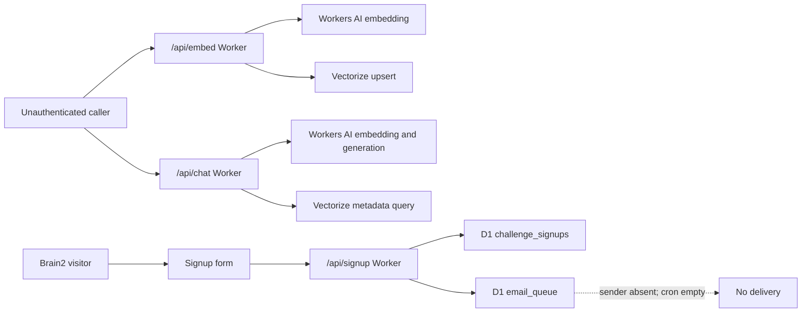
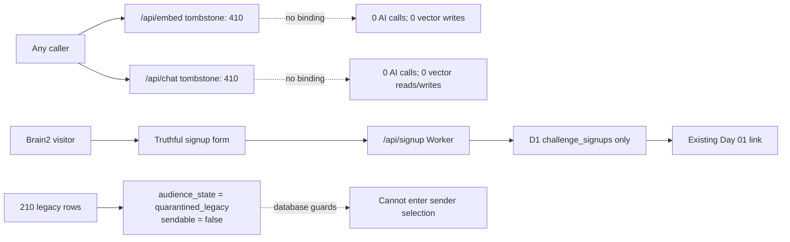

# R0.1 Security and Integrity Remediation Design

**Project:** Thongphan Read Foundation v2 in the canonical `thongphan-com` runtime

**Release:** R0.1 — Security and Integrity Remediation

**Date:** 2026-07-26

**Status:** Corrected and owner-approved; implementation not started

**Verified runtime baseline:** branch `main`, HEAD `c8b10f9e2d8f732f6c3cf6bf62802ac1bd6b562f`

**Documentation correction baseline:** branch `agent/r0-foundation-audit`, HEAD
`ffab17766fa4c1f807e68aa46a0f68c8dcc63d7f`

## 1. Context

Release 0 found five integrity and security gaps outside the future `/read`
product surface: an unauthenticated Vectorize writer, an unauthenticated AI chat
Worker, a signup promise that cannot be fulfilled, 210 legacy email rows without
complete consent lineage, and Cloudflare token-like values in historical handoff
documents. Preview and production data are also not isolated.

R0.1 closes the exposed capabilities and makes the data state truthful. It is
delivered in two separately authorized stages:

- **R0.1A — Local Security Remediation:** source changes, local tests, dry-runs,
  current-tree secret integrity, documentation and an implementation PR only.
- **R0.1B — Owner-Gated Production Cutover:** remote deployment, controlled
  production verification, migration and release closure. It requires a separate
  owner prompt after R0.1A is reviewed and merged.

Potential public-history cleanup is **R0.H1 — Public History Remediation**, a
separate destructive, owner-gated and nonblocking backlog item. R0.H1 is not an
R0.1 exit criterion and is not a prerequisite for R0.2 or PRD-R1 after both
credential candidates are revoked or rotated and current-tree controls pass.

R0.1 does not add a product feature. It does not create reader identity,
membership, payment, entitlement, multi-tenancy, `/read`, or a new AI capability.
Full preview-production isolation remains R0.2.

This document makes one remediation decision for every audited risk. The
companion plans are:

- `docs/superpowers/plans/2026-07-26-r0-1-security-remediation.md` for R0.1A;
- `docs/superpowers/plans/2026-07-26-r0-1-production-cutover.md` for R0.1B.

## 2. Verified repository and production baseline

| Fact | Evidence |
|---|---|
| Canonical runtime | `/Users/rio/thongphan-com`; verified R0 runtime baseline branch `main`; HEAD `c8b10f9e2d8f732f6c3cf6bf62802ac1bd6b562f` |
| GitHub branch state | Canonical runtime branch is `main`; GitHub default branch was still `master` during this correction and must be changed to `main` by a separate owner action before any R0.1B deployment |
| Public Read boundary | `/library` and `/library/read/*`; `/read` is absent (`docs/discovery/R0-AUDIT-REPORT.md:91-132`) |
| Runtime topology | Next.js static export on Pages plus exact-path Workers and a catch-all router (`docs/discovery/R0-AUDIT-REPORT.md:159-189`) |
| Route precedence | Cloudflare selects the most specific matching route; exact API routes therefore win over `thongphan.com/*` ([Cloudflare Routes](https://developers.cloudflare.com/workers/configuration/routing/routes/)) |
| Current embed deployment | Remote Worker `brain2-embedder`, latest deployment 2026-05-04, binds Workers AI and Vectorize; read-only `GET /api/embed` returned HTTP 200 on 2026-07-26 |
| Current chat deployment | Remote Worker `thongphan-chat-api`, latest deployment 2026-05-19, binds Workers AI and Vectorize; read-only `GET /api/chat` returned 405 and `OPTIONS` returned 200 with wildcard CORS on 2026-07-26 |
| Live chat dependency | The live `/chat` bundle contains no apex or workers.dev chat URL; it uses the local deterministic path when `NEXT_PUBLIC_CHAT_API_URL` is absent (`app/chat/ChatClient.tsx:11-47`) |
| Email runtime | Signup Worker is deployed; email Worker does not exist remotely and tracked cron is empty (`wrangler.brain2-email.toml:1-33`) |
| D1 email state | Read-only query on 2026-07-26 returned 10 signups, 210 `legacy-v0/pending` queue rows, zero email logs, and one case-insensitive duplicate group |
| Credential exposure | GitHub repository `thongphan23/thongphan-web` is public; token-like plaintext is reachable in tracked history and an additional distinct candidate exists in ignored local configuration |
| Tooling checked | Wrangler `4.110.0`; local schema `node_modules/wrangler/config-schema.json`; current Workers types package `5.20260726.1` |

The current embed and chat dry-runs both pass, which proves that the risky
bindings are deployable. The embed bundle is 2.23 KiB raw/0.99 KiB gzip; the chat
bundle is 24.66 KiB raw/6.73 KiB gzip. A passing bundle is not a security verdict.

## 3. Verified findings

1. `/api/embed` accepts a public JSON body, invokes Workers AI once per chunk and
   calls `BRAIN2_INDEX.upsert()` without authentication, size limits, rate limits,
   idempotency, or an actor boundary (`workers/embed-vault.ts:28-74`).
2. `/api/chat` accepts public input, invokes an embedding model, queries private
   Vectorize metadata, and invokes a generative model without authentication,
   body bounds, timeout, rate limit, or budget control
   (`workers/api/chat.ts:44-106`). It does not currently call a Vectorize write
   method.
3. The production `/chat` journey is not dependent on the AI Worker. The client
   has a complete local response path (`app/chat/ChatClient.tsx:30-79`,
   `app/chat/chat-model.ts:27-39`).
4. Both the UI and signup Worker promise an email within five minutes even though
   no sender runtime exists (`components/SignupForm.tsx:109-123`,
   `workers/brain2-campaign.ts:332-336`).
5. Signup currently persists one signup and creates 21 new queue rows in a D1
   batch (`workers/brain2-campaign.ts:128-153`,
   `workers/brain2-campaign.ts:303-316`).
6. Existing `legacy-v0` rows are protected from update/delete and excluded by the
   v1 sender, but they lack the explicit required `quarantined_legacy` and
   `sendable=false` contract (`workers/migrations/0002_brain2_access_and_email_campaign.sql:13-40`).
7. The schema contains name, email, signup time and unsubscribe state, but no
   acquisition source, consent timestamp, consent-text version, purpose, legal
   basis, retention deadline, invalid-address state, or bounce lineage
   (`workers/schema.sql:29-65`).
8. Current tests cover functional email isolation but do not reject false success
   copy, generic credential patterns, unauthenticated AI routes, or reintroduction
   of AI/Vectorize bindings.

## 4. Exact call-site map — `/api/embed`

| Kind | Location | Verified behavior | Production necessity |
|---|---|---|---|
| Route implementation | `workers/embed-vault.ts:28-96` | Public POST chunks arbitrary content, embeds it and upserts vectors | Not used by the public application |
| Worker configuration | `wrangler.embed.toml:1-18` | Exact apex route; Workers AI and `brain2-vault` Vectorize bindings | Deployed, but no required production caller |
| Direct HTTP caller | `scripts/embed-via-worker.ts:7-8`, `scripts/embed-via-worker.ts:26-53` | Reads `/Users/rio/obsidian` and POSTs private Markdown to the public endpoint | Manual legacy script; absent from `package.json` |
| Mismatched HTTP caller | `scripts/upload-to-embedder.ts:7-8`, `scripts/upload-to-embedder.ts:24-39` | Calls `/api/embed/embed`, which does not match the implementation | Nonfunctional legacy script; absent from `package.json` |
| Direct Cloudflare writer | `scripts/embed-brain2.ts:45-69`, `scripts/embed-brain2.ts:113-152` | Bypasses the Worker and uses an account API token for AI and Vectorize write | Manual legacy script; absent from build/test/deploy scripts |
| Application imports | Repository-wide search | None | None |
| Form/action callers | Repository-wide search | None | None |
| Automated tests | Repository-wide search | None | None |
| Package scripts | `package.json:6-31` | No embed or Vectorize ingestion command | None |
| Historical instructions | `.claude/handoff.md:146-155`, `.claude/handoff.md:320-327`, `.claude/handoff-chat.md:748-826` | Manual, stale setup/deploy commands | Documentation provenance only |
| Live probe | `curl -X GET https://thongphan.com/api/embed` | HTTP 200 information response on 2026-07-26 | Confirms exposure, not necessity |

Conclusion: there is no necessary production call site and no supported internal
ingestion workflow. R0.1 disables the endpoint; it does not build an internal
replacement.

## 5. Exact call-site map — `/api/chat`

| Kind | Location | Verified behavior | Production necessity |
|---|---|---|---|
| Worker implementation | `workers/api/chat.ts:44-110` | Public POST performs two AI calls and one Vectorize query | Not required by the live client |
| Worker configuration | `wrangler.chat.toml:1-15` | Exact apex route with AI and Vectorize bindings | Deployed capability |
| Client caller | `app/chat/ChatClient.tsx:11`, `app/chat/ChatClient.tsx:30-79` | Fetch occurs only when a public build-time URL exists; otherwise local response runs | Live bundle has no remote URL |
| Local response model | `app/chat/chat-model.ts:27-39` | Deterministic response plus journey recommendations | Required current behavior |
| Next proxy source | `app/api/chat/route.ts:10-41` | Proxies to a configured URL or hardcoded workers.dev hostname | Dead on the static production path; unsafe future fallback |
| Navigation | `components/site-chrome/SiteChrome.tsx:50`, `lib/site-journey.ts:87` | Links to `/chat`, not `/api/chat` | Keep `/chat` unchanged |
| Sitemap/canonical | `app/sitemap.ts:28`, `app/chat/page.tsx:4-8` | `/chat` remains indexable and canonical | Keep unchanged |
| Tests | `scripts/chat-journey.test.ts:1-28`, `scripts/subpage-cinema-contract.test.mjs:88-97` | Cover local response/SSE/UI, not Worker security | Extend for local-only invariant |
| Live artifact | Production `/chat` chunk inspected 2026-07-26 | Contains no apex or workers.dev chat URL | Proves AI Worker is noncritical |
| Live probe | `GET` and `OPTIONS https://thongphan.com/api/chat` | 405 and 200; wildcard CORS is active | Confirms public exposure |

The current Worker has read access only in its executed code: it calls
`BRAIN2_INDEX.query()` and has no `.upsert()`, `.insert()`, or `.deleteByIds()`
call. Removing the binding is still required because the runtime capability and
private metadata path are unnecessary.

## 6. Signup and email call-site map

```text
components/SignupForm.tsx
  -> POST /api/signup
  -> workers/api/signup.ts
  -> handleBrain2SignupRequest()
  -> D1 challenge_signups + 21 email_queue rows
  -> response promises email within five minutes
  -> no deployed email Worker and crons = []
```

Evidence:

- Request and success state: `components/SignupForm.tsx:60-99`,
  `components/SignupForm.tsx:109-123`.
- Shared Worker/Pages handler: `workers/api/signup.ts:1-9`,
  `functions/api/signup.ts:1-11`.
- Queue construction and success response: `workers/brain2-campaign.ts:128-153`,
  `workers/brain2-campaign.ts:249-340`.
- Sender selection is v1-only: `workers/api/email-drip.ts:133-173`.
- Sender config is inert: `wrangler.brain2-email.toml:1-33`.

## 7. Legacy email source and lineage

The 210 rows are 21 queue rows for each of ten historical Brain2 challenge
signups. Git history shows the original public signup handler created the signup
and queued all challenge days with placeholder email bodies. Migration `0002`
later labeled every pre-existing row `legacy-v0` and blocked its update/delete.

Verified inventory on 2026-07-26:

| Dimension | Result |
|---|---:|
| Signup rows | 10 |
| Legacy queue rows | 210 |
| Status | 210 pending; 0 sent/failed/bounced |
| Email logs | 0 |
| Case-insensitive duplicate groups | 1 |
| Acquisition source field | absent |
| Consent timestamp/text version/purpose | absent |
| Invalid/bounce provider evidence | absent |

The source can be described only as “legacy public Brain2 21-day signup flow.”
No row is valid newsletter consent and no row is eligible for sending.

## 8. Token-like plaintext inventory

Secret values are intentionally omitted. Locations and classifications are:

| Location | Classification | Provider | Required action |
|---|---|---|---|
| `.claude/handoff.md:150`, `.claude/handoff.md:407` | Placeholder | Cloudflare | Replace with environment-variable-only instruction |
| `.claude/handoff-chat.md:186`, `.claude/handoff-chat.md:760` | Placeholder | Cloudflare | Replace with environment-variable-only instruction |
| `.claude/handoff.md:323` | Unknown; historical note says invalid | Cloudflare | Treat as exposed; revoke/rotate and sanitize |
| `.claude/handoff-chat.md:809`, `:818`, `:822` | Potentially active; historical note says valid | Cloudflare | Treat as exposed; revoke/rotate and sanitize |
| `.env.embed.local:1` | Unknown, distinct local candidate; ignored by Git | Cloudflare | Revoke/rotate and sanitize local file |
| `.env.local.bak:1` | Placeholder | Cloudflare | Keep ignored; scanner must classify it safely |

The tracked candidates are the same token-like value and exist in reachable Git
history. The ignored local candidate is different. Rotation/revocation plus a clean
current tracked tree and sanitized approved ignored local configuration are the
mandatory R0.1 controls. Historical discoverability remains an explicitly
documented residual risk until optional R0.H1 completes.

## 9. Current data flow



## 10. Target R0.1 data flow



## 11. Threat model

| Surface | Asset | Threat actor/action | Current impact | R0.1 control |
|---|---|---|---|---|
| `/api/embed` | Vectorize integrity, private Brain2 metadata, Workers AI budget | Anonymous write, content poisoning, oversized body, repeated cost, internal error probing | Arbitrary vector mutation and uncontrolled AI calls | Deterministic 410 tombstone; no body read; no AI/Vectorize binding; no CORS; legacy callers removed |
| `/api/chat` | Private retrieval context, brand voice, AI budget | Anonymous prompt injection, context exfiltration, request flood, long body, cost amplification | Unbounded AI use and possible private metadata disclosure | Deterministic 410 tombstone; no body read; no AI/Vectorize binding; client fixed to local mode |
| Signup | User trust and email PII | False delivery expectation; unnecessary queue growth | Persisted obligations that runtime cannot fulfill | Canonical truthful message; save signup only; no queue creation |
| Legacy email | PII, consent integrity, brand trust | Accidental sender selection, import to newsletter, dedupe mistake | Unconsented delivery and retention risk | Explicit quarantine fields, global non-sendable triggers, sender predicate, aggregate-only inventory |
| Documentation | Cloudflare account and deployment capabilities | Credential discovery from public files/history | Account/API compromise | Revoke/rotate both candidates, sanitize current tracked and approved ignored local files, enforce current-tree scanning; track optional history cleanup as R0.H1 |
| Shared preview data | Production D1/KV | Preview test mutates production | Integrity/privacy damage | No preview mutation in R0.1; endpoint bindings removed; D1 isolation remains R0.2 |

## 12. Root-cause analysis

### 12.1. Public Vectorize write

- **Technical root cause:** a one-off ingestion Worker was placed on a public
  production route with write-capable bindings and no gate.
- **Process root cause:** deployment completion was treated as feature completion;
  threat modeling and ownership were absent.
- **Why gates missed it:** no test imported the Worker, probed anonymous writes, or
  inspected dry-run bindings.
- **Wrong boundary:** a local/private ingestion operation became a public website API.
- **Recurrence control:** exact disabled-endpoint contract plus configuration scan
  that rejects AI/Vectorize bindings and public ingestion scripts.
- **Regression proof:** anonymous and fake-service-identity requests return 410;
  dependency spies remain at zero; dry-run lists no bindings.

### 12.2. Chat endpoint exposure

- **Technical root cause:** a prototype RAG Worker remained deployed after the
  public client moved to a local deterministic path.
- **Process root cause:** no production-dependency review retired an unused paid
  capability.
- **Why gates missed it:** UI tests covered the local model and SSE parsing, not
  production route reachability, CORS, binding least privilege, or cost.
- **Wrong boundary:** optional prototype infrastructure was treated as permanent
  public runtime.
- **Recurrence control:** local-only client invariant, tombstone Worker, no AI or
  Vectorize binding, hard-zero AI budget test.
- **Regression proof:** `/chat` still works locally; `/api/chat` returns 410 under a
  burst and invokes no downstream capability.

### 12.3. False signup promise

- **Technical root cause:** success copy was duplicated in the UI and Worker while
  delivery readiness lived in a separate undeployed Worker/config.
- **Process root cause:** content truth was not part of the release gate.
- **Why gates missed it:** tests asserted resilient response handling but did not
  assert delivery-runtime readiness or the exact success message.
- **Wrong boundary:** a storage success was presented as a delivery success.
- **Recurrence control:** one shared signup copy contract and a prohibition on queue
  creation while delivery is inactive.
- **Regression proof:** source and built artifact contain the inactive-delivery
  message and no five-minute promise; successful signup prepares no queue statement.

### 12.4. Legacy email without consent lineage

- **Technical root cause:** the original schema captured address and schedule but no
  purpose/versioned consent/source/retention fields.
- **Process root cause:** a challenge signup was implicitly treated as sufficient
  email authorization.
- **Why gates missed it:** the later v1-only sender test prevented selection but did
  not model audience eligibility or retention.
- **Wrong boundary:** queue status was used as audience permission.
- **Recurrence control:** separate audience state and sendability from delivery
  status; database triggers make every R0.1 row non-sendable.
- **Regression proof:** all 210 rows read back as `quarantined_legacy/0`; insert and
  update attempts to set sendable fail; sender selects zero.

### 12.5. Token-like plaintext in documentation

- **Technical root cause:** shell commands and debugging notes copied raw token-like
  values into tracked Markdown.
- **Process root cause:** documentation review and release gates had no generic
  credential scan and the repository later became public.
- **Why gates missed it:** the private Brain2 scanner searches protected-content
  fingerprints, not provider credential patterns or Git history.
- **Wrong boundary:** a runtime credential entered the documentation provenance layer.
- **Recurrence control:** provider-aware scanner, redacted output, environment-variable
  instructions, pre-commit/release integration and credential rotation.
- **Regression proof:** synthetic token fixtures fail without printing their value;
  the current tracked tree and approved ignored local configuration pass after
  sanitization. The history scan remains a separate expected-red diagnostic until
  optional R0.H1.

### 12.6. Preview-production binding overlap

- **Technical root cause:** tracked configs do not define isolated environments and
  Pages preview/production share D1/KV.
- **Process root cause:** preview was used as a release surface before a resource
  ownership matrix existed.
- **Why gates missed it:** dry-runs validated syntax, not resource separation.
- **Wrong boundary:** deployment environment and data environment were conflated.
- **Recurrence control:** R0.1 removes all data/AI bindings from the two retired
  endpoints and prohibits preview writes; R0.2 owns complete D1/KV separation.
- **Regression proof:** embed/chat dry-runs list zero bindings; R0.1 production plan
  performs mutation smoke only on the apex.

## 13. Final remediation decisions

### 13.1. `/api/embed`

Keep the exact Cloudflare route and replace its Worker with a deterministic
`410 Gone` tombstone. Remove Workers AI and Vectorize bindings, remove the three
legacy ingestion scripts, disable workers.dev and preview URLs, and never parse the
request body. There is no internal endpoint in R0.1. A request carrying fabricated
Cloudflare Access headers still receives 410 and cannot reactivate a write path.

### 13.2. `/api/chat`

Keep the public `/chat` page and its deterministic local response model. Replace the
exact `/api/chat` Worker with the same 410 tombstone, remove AI and Vectorize
bindings, remove the dead Next proxy, remove the public build-time remote URL hook,
and disable workers.dev/preview URLs. The allowed AI budget is exactly zero.

### 13.3. Signup promise

Use one shared success contract:

> Đã ghi nhận đăng ký. Email tự động hiện chưa được kích hoạt; bạn có thể bắt đầu Ngày 01 ngay trên website.

The form also states that name/email are stored only to record the Brain2 21-day
registration and are not added to a newsletter. A successful R0.1 signup writes
`challenge_signups` only and creates no `email_queue` rows.

### 13.4. Legacy email rows

Add `audience_state='quarantined_legacy'` and `sendable=0` for every `legacy-v0`
row. R0.1 database triggers reject any insert/update that makes a queue row
sendable. Sender SQL requires both an explicitly sendable audience state and
`sendable=1`, so it selects zero rows. No email Worker or cron is deployed.

### 13.5. Token-like plaintext

The Cloudflare account owner revokes/rotates both candidates before sanitization and
provides non-secret confirmation. Tracked handoffs are redacted, the approved
ignored local credential file is sanitized, and a native Node scanner is added to
tests and the release gate. `test:release` includes current-tree secret integrity
only. `test:secret-integrity:history` remains a separate expected-red diagnostic and
does not block R0.1A, R0.1B, R0.2 or PRD-R1.

Because a candidate marked valid was committed to a public repository, an optional
later R0.H1 may rewrite reachable history under a separate destructive-action
approval, collaborator freeze and force-push protocol. Only R0.H1 uses a passing
history scan as its completion gate.

## 14. Authentication and authorization boundary

- Disabled embed/chat endpoints authorize nobody and perform no operation. They
  return 410 before body parsing, identity evaluation, or dependency access.
- No Cloudflare Access service token, Turnstile, API key, or shared secret is added
  for these retired endpoints.
- Reintroducing embed ingestion requires a separate ADR and an internal-only service
  identity boundary; it cannot be done inside R0.1 or R1 implicitly.
- Signup remains a public same-origin action protected by exact origin checking,
  bounded JSON validation and existing IP/email rate-limit bindings
  (`workers/brain2-campaign.ts:230-288`). Signup does not confer marketing consent.
- The absent email Worker remains absent; no admin or scheduled send surface is
  activated.

## 15. Rate-limit, abuse and budget boundary

The two tombstones have no paid downstream capability. They do not need a runtime
rate-limit binding because every request follows a constant, body-free path and the
AI/Vectorize budget is hard zero. Tests send a bounded burst and prove the response
stays 410 while AI, Vectorize and body-read counters remain zero. Cloudflare account
traffic controls remain the outer volumetric boundary.

Signup retains its current 5 requests/minute opaque IP key and 2 requests/minute
opaque email key (`wrangler.signup.toml:28-42`). R0.1 does not alter these limits.

## 16. Secret handling

1. Never echo, interpolate into command arguments, commit, log, or paste a secret.
2. Rotation precedes source sanitization so removing the visible copy cannot create
   a false belief that the credential is safe.
3. Provider is Cloudflare. Operational owner is the authorized administrator of the
   Cloudflare account currently used by Wrangler deployments; project owner is Thông
   Phan.
4. New credentials, if any, live only in an authorized password manager/Keychain or
   Cloudflare encrypted secrets. R0.1 creates no new endpoint secret.
5. Scanner output contains only rule ID, file and line; never a matching value,
   substring, hash, request header or environment value.
6. R0.1 requires the current tracked tree and approved ignored local configuration
   to pass the redacted scanner after rotation. Public history exposure is retained
   as a documented residual risk and may be remediated only through optional R0.H1.

Official control reference: [Cloudflare Secrets](https://developers.cloudflare.com/workers/configuration/secrets/).

## 17. Logging and redaction policy

Embed/chat tombstones emit one structured event with only:

- `event`: `disabled_endpoint_hit`;
- `endpoint`: `/api/embed` or `/api/chat`;
- HTTP method;
- status `410`;
- Cloudflare request ID when present;
- fixed counters `ai_calls=0`, `vector_reads=0`, `vector_writes=0`.

They never log body, query string, IP, authorization/Cookie/Access headers, user
message, file path, embedded text, vector metadata, name, email, token, or exception
object. Observability is enabled at a bounded sample. Cloudflare recommends
structured Workers logs and supports head sampling
([Workers Logs](https://developers.cloudflare.com/workers/observability/logs/workers-logs/)).

## 18. Legacy email quarantine design

Migration `workers/migrations/0003_r0_1_email_integrity.sql` is a planned new file;
it is not created or applied in this design session.

The migration contract is:

```sql
audience_state TEXT NOT NULL DEFAULT 'delivery_inactive'
  CHECK (audience_state IN ('delivery_inactive', 'quarantined_legacy', 'sendable'))
sendable INTEGER NOT NULL DEFAULT 0 CHECK (sendable IN (0, 1))
```

The schema recognizes `delivery_inactive`, `quarantined_legacy` and `sendable`, but
R0.1 insert/update triggers reject both `audience_state='sendable'` and
`sendable=1`. The migration temporarily replaces the existing legacy update guard,
changes only `legacy-v0` rows to `quarantined_legacy/0`, and restores immutable
update/delete guards. The v1 sender requires `audience_state='sendable' AND
sendable=1`, so no R0.1 row can satisfy it.

Inventory rules:

- report aggregate counts only;
- normalize email only in-memory/SQL for duplicate counts;
- do not print addresses or names;
- do not merge or delete the duplicate group;
- do not infer consent from signup, pending status, validity, or absence of bounce;
- invalid/bounced/failed rows remain non-sendable;
- do not import any row into a newsletter/audience provider;
- deletion occurs only after the owner approves retention duration, lawful purpose,
  evidence retention and deletion audit requirements.

## 19. Signup copy and data-use integrity

One pure module, `lib/brain2/signup-contract.ts`, owns the exact success message and
data-use notice. Both the UI and Worker import the success message. The UI links to
the already existing `/brain2/21-ngay/ngay-01` route and makes no delivery promise.

The data-use notice is descriptive, not a marketing-consent checkbox. It says the
system stores name/email to record this registration, email automation is inactive,
and the address is not added to a newsletter. Activating email later requires a
separate reviewed consent and delivery design.

## 20. Environment dependency boundary

- `wrangler.embed.toml` and `wrangler.chat.toml` keep exact apex routes but contain
  no AI, Vectorize, D1, KV, secret or rate-limit binding.
- Both set `workers_dev=false` and `preview_urls=false`.
- The global router remains unchanged. Exact Worker routes continue to win by
  Cloudflare specificity.
- Signup production D1 remains shared with Pages preview during R0.1. Preview tests
  are therefore static/read-only.
- R0.2 must create explicit preview/staging/production resources before any future
  preview mutation.
- R0.1B may run only after the documentation PR and R0.1A implementation PR are
  merged, GitHub default branch is `main`, and a fresh clean checkout proves
  `HEAD == origin/main`. No production command may run from a feature or docs branch.

The current Wrangler config schema and current Workers type package were checked on
2026-07-26. Final implementation uses the repository-pinned Wrangler version and
`wrangler deploy --dry-run`, which compiles without deployment
([Wrangler deploy](https://developers.cloudflare.com/workers/wrangler/commands/workers/#deploy)).

## 21. Failure modes

| Failure | Safe behavior | Required response |
|---|---|---|
| Tombstone deploy fails | Existing exposure remains; no other release claim is made | Stop rollout, record failed command, retry only after control-plane health is verified |
| Exact route falls through | Global router/Pages response differs from 410 | Restore the verified tombstone route/config, then repeat exact-route smoke |
| Binding reappears in dry-run | Paid/private capability is deployable again | Fail release before upload |
| `/chat` local response regresses | Public page loses useful response | Revert UI-only change; keep `/api/chat` tombstone deployed |
| Signup Worker copy updates before Pages | Direct API is truthful; UI may still show old copy | Deploy Worker first, then Pages; release is incomplete until both match |
| Migration fails | Email Worker remains absent; cron remains empty | Stop, use the pre-migration D1 Time Travel bookmark if integrity changed |
| Quarantine count differs from 210 | Source state drifted | Stop without update, rerun aggregate audit, amend evidence before mutation |
| Rotation cannot be proven | Credential may still work | Do not claim secret remediation complete |
| R0.H1 lacks owner approval | Revoked value remains public in history | Keep it revoked, record residual exposure, do not force-push; R0.1 and later planning remain unblocked after mandatory current-tree controls pass |

## 22. Rollback strategy

- **Embed/chat:** security rollback is re-deploying the last verified 410 version.
  The unauthenticated AI/Vectorize versions are not valid rollback targets.
- **Chat UI:** revert only the local-client commit if `/chat` behavior fails; the API
  tombstone and removed bindings stay in place.
- **Signup:** revert UI presentation only if rendering fails. Do not restore the false
  promise or queue creation.
- **D1:** record a D1 Time Travel bookmark immediately before migration. Restore only
  when migration integrity fails and after verifying that no legitimate post-bookmark
  signup would be lost. Email remains undeployed during the decision.
- **Secrets:** revocation is irreversible by design. Create a new least-privilege
  credential only for an approved workflow; never restore a leaked token.
- **R0.H1 history rewrite:** outside R0.1. If separately approved, keep a private
  read-only mirror before force-push. If coordination fails, do not restore leaked
  refs to the public remote; correct refs and require collaborators to reclone.

## 23. Observability

R0.1 records:

- deployed Worker version IDs for both tombstones;
- 410 counts and sampled request IDs without caller/body data;
- dry-run proof that both Workers have zero bindings;
- pre/post D1 aggregate counts and Time Travel bookmark;
- signup count and zero newly created queue rows during controlled smoke;
- secret scan file count, rule count and hit count without values;
- non-secret credential rotation confirmation and current-tree scan summary;
- public-history findings as a documented residual risk, without credential values;
- unchanged hashes for `tsconfig.tsbuildinfo` and the four pre-existing Conan Maker
  assets.

## 24. Testing strategy

The implementation follows regression-first TDD:

1. Import each current endpoint and prove the security test fails against live source.
2. Replace with the shared tombstone and prove 410 plus zero dependency access.
3. Test a fabricated service identity against embed and prove it cannot bypass 410.
4. Test chat under a bounded burst and prove hard-zero AI/Vectorize budget.
5. Test the built `/chat` artifact contains no remote chat URL hook.
6. Test shared signup copy and absence of queue statements.
7. Apply migrations to a local SQLite fixture with 210 legacy rows and prove exact
   quarantine, duplicate inventory and sendability-trigger rejection.
8. Test generic secret detection with synthetic credentials; verify output redaction.
9. Run TypeScript, Worker TypeScript, lint, full tests, build, release, Read safety,
   all relevant Wrangler dry-runs, current-tree secret scan and Git diff review.
10. Execute build/release verification in a disposable clean worktree so unrelated
    dirty files in the canonical worktree cannot be rewritten.
11. Keep `test:secret-integrity:history` outside `test:release`; record its expected
    residual finding without using it as an R0.1A or R0.1B release gate.

## 25. Planned file changes

### New files

- `workers/security/disabled-endpoint.ts`
- `lib/brain2/signup-contract.ts`
- `workers/migrations/0003_r0_1_email_integrity.sql`
- `scripts/embed-worker-security.test.ts`
- `scripts/chat-worker-security.test.ts`
- `scripts/secret-integrity-scan.mjs`
- `scripts/secret-integrity-scan.test.mjs`
- `scripts/r0-1-change-boundary.mjs`
- `scripts/r0-1-change-boundary.test.mjs`
- `scripts/r0-1-production-smoke.mjs`
- `scripts/r0-1-production-smoke.test.mjs`
- `docs/security/R0-1-IMPLEMENTATION-REPORT.md`

### Modified files

- `workers/embed-vault.ts`
- `workers/api/chat.ts`
- `wrangler.embed.toml`
- `wrangler.chat.toml`
- `app/chat/ChatClient.tsx`
- `app/chat/chat-model.ts`
- `components/SignupForm.tsx`
- `workers/brain2-campaign.ts`
- `workers/api/email-drip.ts`
- `scripts/chat-journey.test.ts`
- `scripts/brain2-email-campaign.test.ts`
- `tsconfig.brain2-workers.json`
- `package.json`
- `.claude/handoff.md`
- `.claude/handoff-chat.md`
- `workers/README.md`
- `docs/discovery/CURRENT-SYSTEM-AUDIT.md`
- `docs/architecture/SAD-CLOUDFLARE-FIRST.md`
- `docs/architecture/DATA-AND-EVENT-ARCHITECTURE.md`
- `docs/STATUS.md`

### Deleted files

- `app/api/chat/route.ts`
- `scripts/embed-via-worker.ts`
- `scripts/upload-to-embedder.ts`
- `scripts/embed-brain2.ts`

The ignored `.env.embed.local` is sanitized operationally after rotation and is not
committed. No Conan Maker asset or `tsconfig.tsbuildinfo` is edited.

## 25.1. Delivery workflow and merge sequence

1. Correct these documents on `agent/r0-foundation-audit` and keep Draft PR #1
   documentation-only.
2. Under a later explicit owner action, change the GitHub default branch from
   `master` to canonical runtime branch `main`.
3. Review and merge the documentation correction PR into `main`.
4. Create `agent/r0-1a-security-remediation` from the new `origin/main`.
5. Execute only the R0.1A local plan, open a separate implementation PR, review it
   and merge it into `main`.
6. Start R0.1B only after another explicit owner prompt, from a fresh checkout that
   proves clean merged-main identity.

No stage inherits production authorization from an earlier review or merge.

## 26. Out of scope

- PRD-R1 and every `/read` implementation.
- Reader account, authentication, Member, entitlement, payment and workspace data.
- New AI, RAG, chat provider, embedding pipeline or internal ingestion endpoint.
- Email sender deployment, cron activation, provider import or newsletter audience.
- Marketing-consent acquisition.
- Legacy-row deletion before the retention gate.
- Complete preview/staging/production D1/KV separation; owned by R0.2.
- Framework, public content route, canonical, sitemap or router changes.

## 27. OWNER BLOCKERS

### 27.1. Credential revocation authority

Repository evidence cannot identify the Cloudflare token IDs or revoke them safely.
The authorized Cloudflare account administrator must revoke/rotate both candidate
credentials and provide non-secret confirmation before current-tree sanitization can
be accepted. R0.1A source changes may be reviewed before confirmation, but R0.1B may
not begin until the confirmation and sanitized current-tree scan both pass.

### 27.2. Legacy PII retention and deletion policy

The repository contains no approved retention duration, legal purpose, deletion
deadline or evidence-retention rule for the ten legacy signup records and 210 queue
rows. The project owner must approve these values before deletion. Quarantine does not
wait for this decision and must occur first.

## 28. Residual risks

1. Until implementation deploys the tombstones, both public AI Workers remain live.
2. Until Cloudflare credentials are revoked, token candidates remain potentially
   usable even after local sanitization.
3. Until the approved history rewrite completes and caches/forks age out, revoked
   plaintext remains discoverable in public history.
4. Signup and Pages preview still share production D1/KV; R0.1 forbids preview
   mutation but cannot technically isolate it.
5. Ten signup records retain PII without an approved deletion date.
6. Cloudflare account-level routes, WAF and logs can drift outside Git; production
   readback remains required.
7. A disabled endpoint still consumes a low-cost Worker invocation under traffic,
   though it cannot invoke AI or data bindings.

## 29. Stage gates and exit criteria

### 29.1. R0.1A local remediation exit

R0.1A is ready for implementation review only when:

1. Source implements binding-free 410 tombstones for `/api/embed` and `/api/chat`,
   while `/chat` remains deterministic and local.
2. Signup UI/API use the inactive-delivery contract and prepare only one
   `challenge_signups` statement with no `email_queue` statement.
3. Migration `0003_r0_1_email_integrity.sql` passes local fixture tests proving
   `quarantined_legacy/0`, zero sendable rows and rejection triggers.
4. The production smoke runner is built by TDD but performs no remote mutation in
   R0.1A.
5. `test:release` includes the current-tree secret-integrity gate and excludes the
   history scan.
6. TypeScript, Worker TypeScript, lint, full tests, build, Read safety, relevant
   Wrangler dry-runs, current-tree scanner and Git diff review pass.
7. Pre-existing `tsconfig.tsbuildinfo` and four Conan Maker asset hashes are unchanged.
8. The R0.1A implementation report is ready and no production deployment, production
   migration or history rewrite has occurred.

### 29.2. R0.1B production cutover exit

R0.1B is complete only when:

1. The documentation PR and R0.1A implementation PR are merged to GitHub default
   branch `main`.
2. Production commands run from a fresh clean checkout with fetched refs,
   `HEAD == origin/main`, an empty porcelain status and the exact main SHA recorded.
3. Both credential candidates are confirmed revoked/rotated without disclosure;
   current tracked and approved ignored local files are sanitized and scan clean.
4. `/api/embed` and `/api/chat` return 410 with zero bindings; `/chat` remains local.
5. A controlled apex signup creates exactly one signup and zero queue rows, and only
   that synthetic signup is removed after evidence capture.
6. The only unapplied migration is `0003_r0_1_email_integrity.sql`; after its apply,
   the exact aggregate is `legacy-v0 | pending | quarantined_legacy | 0 | 210`, with
   zero sendable rows and zero email logs.
7. Pages is built and deployed from the exact merged main SHA; `/library`, a
   representative `/library/read/*`, `/chat`, canonical and sitemap pass read-only
   smoke.
8. No email Worker, cron, newsletter import or provider send exists.
9. Evidence is recorded and the project stops before R0.2 and PRD-R1.

### 29.3. R0.H1 public-history remediation

R0.H1 is recommended because revoked plaintext remains discoverable in public Git
history, but it is destructive and nonblocking. It requires a separate owner prompt,
collaborator freeze, protected mirror, coordinated force-push and fresh-clone proof.
Only R0.H1 requires `test:secret-integrity:history` to pass. R0.H1 is not part of
R0.1A or R0.1B exit and is not a prerequisite for R0.2 or PRD-R1.

If the owner later authorizes R0.H1, its safety protocol is:

1. Reconfirm both candidates are revoked or rotated; never expose either value in a
   command, replacement file, log or report.
2. Approve an exact collaborator push-freeze window and the exact branch/tag set that
   may be rewritten.
3. Create a private read-only mirror and a mode-`0600` replacement input outside the
   repository; verify `git-filter-repo` from its trusted package source.
4. Rewrite only in a dedicated mirror clone, scan every rewritten reachable ref, and
   force-push only the separately approved ref set.
5. Clone the public remote into a fresh directory, rerun the history scanner, verify
   remote heads/tags, and require collaborators to reclone or adopt the rewritten
   history after preserving unrelated work.
6. Never republish old leaked refs as rollback. Correct a bad mapping from the private
   mirror, rescan, and push the corrected rewritten refs.

R0.H1 has no implied schedule and cannot be executed from either R0.1 plan.
